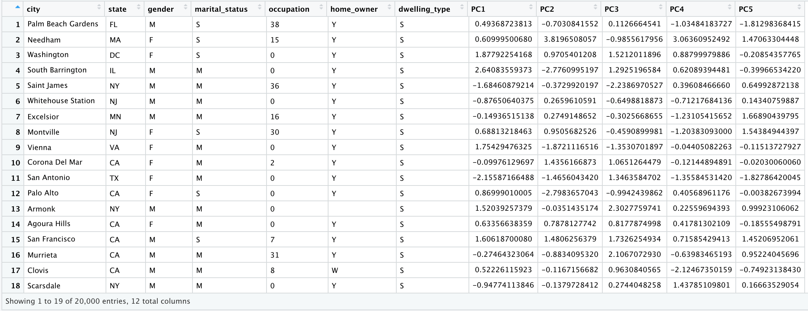
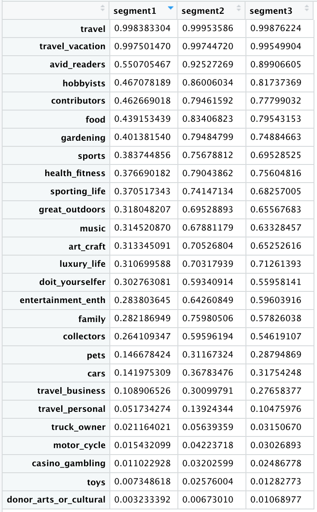

# Bank Existing Customer Segmentation Analysis


Use a Bank's 20,000 exisiting customers' demographic and interest data to do a segmentation analysis. Providing insights to the bank's new trust product design.

## Part 1: Prepare the Data

### load data source
```
setwd("/Users/chencheng/Desktop/R Review/Github/R/Bank")
customerData=read.csv("./Customer Database.csv", stringsAsFactors=T)
str(customerData)
```

### change variable zip_code, county_code and occupation from integer to factor
```
customerData[,1] = as.factor(customerData[,1]) # zip_code
customerData[,2] = as.factor(customerData[,2]) # country_code
customerData[,12] = as.factor(customerData[,12]) # occupation
summary(customerData)

customerDataPrep = customerData
```

### drop variables not used in the following segmentation modeling
```
drop = c("zip_code","county_code","county_name","income","num_of_adults","children",
         "child0_3","child4_6","child7_9","child10_12","child13_18",
       "great_outdoors","sporting_life","health_fitness","luxury_life","doit_yourselfer",
       "truck_owner","motor_cycle","sports","entertainment_enth","hobbyists","avid_readers",
       "collectors","travel","pets","music","toys","art_craft","gardening","family","food","cars",
       "casino_gambling","contributors","travel_business","travel_personal","travel_vacation","donor_arts_or_cultural",
       "AAPPAREL","ACASHCONT","AEDUCATN","AENTRTAIN","AFOODTOTL","AGTOTALE",
       "AHEALTH","AHOUSING","AINSPENSN","AREADING","ATRANS")

customerDataPrep = customerDataPrep[,!(names(customerDataPrep) %in% drop)]
summary(customerDataPrep)
```

### replace NA in education_code, year_structure with median
```
customerDataPrep$education_code = 
  ifelse(is.na(customerDataPrep$education_code), median(customerDataPrep$education_code,na.rm = T), 
         customerDataPrep$education_code)

customerDataPrep$year_structure = 
  ifelse(is.na(customerDataPrep$year_structure), median(customerDataPrep$year_structure,na.rm = T), 
         customerDataPrep$year_structure)

customerDataPrep$contributor_index = 
  ifelse(is.na(customerDataPrep$contributor_index), median(customerDataPrep$contributor_index,na.rm = T), 
         customerDataPrep$contributor_index)

summary(customerDataPrep)
```

### reorder columns - categorical variables first, numerical variables last
```
customerDataPrep = customerDataPrep[,c(1,2,3,4,8,11,12,5,6,7,9,10,13,14,15,16)]
customerDataPrepCopy = customerDataPrep
```

### rescale all numeric variables
```
options(scipen = 999) # disable scientific notation

rescale = function(r) {
  if (sd(r) != 0) 
    res = (r - mean(r))/sd(r) else res = 0 * r
    return(res)
}

numericVariablesScaled = apply(customerDataPrep[,8:16],2,rescale)
customerDataPrep = cbind(customerDataPrep[,1:7],numericVariablesScaled)

save.image(file="Bank.Rdata")
```

customerDataPrep


## Part 2: Convert Multiple Numeric Variables into a Smaller Group of Components/Factors for the Following Modeling

### approach 1: principal component analysis (PCA)
```
pca.out = prcomp(numericVariablesScaled,scale=T)
summary(pca.out)
print(pca.out)
```

|Importance of components|PC1   |    PC2|    PC3|    PC4|    PC5|    PC6|     PC7|     PC8|     PC9|
|------------------------|------|-------|-------|-------|-------|-------|--------|--------|--------|
|Standard deviation      |1.3156| 1.1380| 1.1182| 1.0159| 1.0005| 0.9217| 0.89705| 0.84470| 0.56818|
|Proportion of Variance  |0.1923| 0.1439| 0.1389| 0.1147| 0.1112| 0.0944| 0.08941| 0.07928| 0.03587|
|Cumulative Proportion   |0.1923| 0.3362| 0.4751| 0.5898| 0.7010| 0.7954| 0.88485| 0.96413| 1.00000|

check each component's loadings

|             |PC1        |PC2       |PC3         |PC4        |PC5         |PC6       | PC7       |   PC8     |        PC9|
|-------------|-----------|----------|------------|-----------|------------|----------|-----------|-----------|-----------|
|age          |-0.06002696|0.43044563|-0.202825435|-0.58495349|-0.155704886|0.12453794|-0.62198336|0.014132329|0.031430047|
|median_income|0.09764583|-0.29278768|-0.503496310|0.39863443|-0.054197808|0.48443174|-0.30585471|0.397889507|-0.053367108|
|education_code|-0.06537888|0.09219507|-0.154050855|0.13281871|-0.934237980|-0.19032435|0.18984889|0.002534438|-0.027932227|
|num_in_hhld  |-0.68528502|-0.07310509|0.003767201|0.05554515|0.057077853|-0.03745541|-0.09682649|-0.052878402|-0.710709752|
|num_of_children|-0.61829838|-0.24419031|0.199204380|0.11800869|-0.056159278|-0.05123793|-0.24681769|0.059287414|0.658981495|
|year_structure|-0.10010104|-0.43703397|0.043062282|-0.56863403|-0.159791238|0.54873699|0.37667042|-0.071867631|0.009538879|
|median_home_value|-0.14637579|0.53710560|0.126274605|0.35221487|-0.008382548|0.60946885|0.13332999|-0.390252629|0.092165918|
|len_of_residence|-0.30058884|0.39562070|-0.363902729|-0.12874983|0.211590885|-0.05728461|0.49781896|0.534682469|0.149558066|
|contributor_index|0.09423098|0.13972073|0.701213401|0.01707002|-0.152420559|0.18362601|-0.07597010|0.625954677|-0.158321730|

**findings:**
**first 5 components explain around 70% of variances**
**PC1 highly related with num_in_hhld(-), num_of_children(-)**
**PC2 highly related with median_home_value(+), year_structure(-)**
**PC3 highly related with contributor_index(+), median_income(-)**
**PC4 highly related with age(-), year_structure(-)**
**PC5 highly related with education_code(-)**

check how many components' variances are above 1 / has big drop
```
plot(pca.out) 
#optional
#pca.var = pca.out$sdev^2 # create variances from sd
#pca.pve = pca.var/sum(pca.var)
#plot(pca.pve)
#plot(cumsum(pca.pve))
```


### approach 2: factor analysis
```
library(GPArotation)
library(psych)
fa.parallel(numericVariablesScaled,fa="fa",n.iter=30,main="Scree plots with parallel analysis")
```


sharp breaks in the plot suggest the appropriate number of factors to extract
parallel analysis suggests that the number of factors =  5 

```
fa1 = factanal(numericVariablesScaled,factors = 5,rotation = "varimax", scores = "regression")
fa1
head(fa1$scores)
```

check the loadings

|                 |Factor1|Factor2|Factor3|Factor4|Factor5|
|-----------------|-------|-------|-------|-------|-------|
|age              |       |       |  0.456|       |  0.105| 
|median_income    |       | -0.302| -0.141|       |       |
|education_code   |       |       |       |       |  0.295| 
|num_in_hhld      |  0.977|       |  0.177|       |       |
|num_of_children  |  0.674|       |       | -0.111|       | 
|year_structure   |       |       |       | -0.308|       | 
|median_home_value|       |  0.123|  0.106|  0.454|       | 
|len_of_residence |  0.154| -0.118|  0.346|  0.206|       | 
|contributor_index|       |  0.717| -0.175|       |       | 


|               |Factor1|Factor2|Factor3|Factor4|Factor5|
|---------------|-------|-------|-------|-------|-------|
|SS loadings    | 1.455 |  0.649|  0.431|  0.364|  0.127|
|Proportion Var | 0.162 |  0.072|  0.048|  0.040|  0.014|
|Cumulative Var | 0.162 |  0.234|  0.282|  0.322|  0.336|

**findings:**
**first 5 factors explain around 33.6% of variances**
**factor1 highly related with num_in_hhld**
**factor2 highly related with contributor_index**
**factor3 highly related with len_of_residence**
**factor4 highly related with median_home_value**
**factor5 highly related with education_code**

### use principal component analysis (PCA)'s result in this case
combine string variables with first 5 components together for kcca clustering
```
customerDataPrep = as.matrix(cbind(customerDataPrep[,1:7],pca.out$x[,1:5]))
View(customerDataPrep)
```



## Part 3: KCCA Segmentation Analysis
### define distance function which calculate distance between 2 observations

For any comparations with NA records, return 0.5. Other columns' distance is calculated by absloute difference of 2 numbers. The total distance is the sum of all columns' distance.

```
distance = function(x,y) {
  if (x[1] == y[1] & x[2] == y[2])
    d1 = 0
  else if (x[1] != y[1] & x[2] == y[2])
    d1 = 0.5
  else
    d1 = 1
  
  if (x[3] == '' | y[3] == '') 
    d3 = 0.5
  else if (x[3] == y[3])
    d3 = 0
  else
    d3 = 1
  
  if (x[4] == ''| y[4] == '') 
    d4 = 0.5
  else if (x[4] == y[4])
    d4 = 0
  else
    d4 = 1
  
  if (x[5] == 0 | y[5] == 0) 
    d5 = 0.5
  else if (x[5] == y[5])
    d5 = 0
  else
    d5 = 1
  
  if (x[6] == ''| y[6] == '') 
    d6 = 0.5
  else if (x[6] == y[6])
    d6 = 0
  else
    d6 = 1
  
  if (x[7] == y[7]) 
    d7 = 0
  else
    d7 = 1
  
  d8 = abs(as.numeric(x[8])-as.numeric(y[8]))
  d9 = abs(as.numeric(x[9])-as.numeric(y[9]))
  d10 = abs(as.numeric(x[10])-as.numeric(y[10]))
  d11 = abs(as.numeric(x[11])-as.numeric(y[11]))
  d12 = abs(as.numeric(x[12])-as.numeric(y[12]))
  
  dis = d1+d3+d4+d5+d6+d7+d8+d9+d10+d11+d12
  return(dis)
}
```

test
```
distance(customerDataPrep[1,], customerDataPrep[2,]) #16.11934
distance(customerDataPrep[34,], customerDataPrep[34,]) #1.5
```

### create pair-wise distance matrix
```
distanceMatrix = function(m1,m2) {
  m = matrix(
    rep(NA,nrow(m1)*nrow(m2)), 
    nrow=nrow(m1), 
    ncol=nrow(m2)
  )
  
  for (i in 1:nrow(m1)){
    for (j in 1:nrow(m2)){
      m[i,j] = distance(m1[i,],m2[j,])
    }
  }
  
  return(m)
}
```

test
```
distanceMatrix(customerDataPrep[1:2,], customerDataPrep[1:2,])
#         [,1]     [,2]
#[1,]  0.00000 16.11934
#[2,] 16.11934  0.00000
```

### define cluster center
pick the most frequently showed city/state/gender/marital_status as center
calculate mean of other numeric variables as center
```
centroid = function(m) {
  city = tail(names(sort(table(m[,1]))), 1)
  state = tail(names(sort(table(m[,2]))), 1)
  gender = tail(names(sort(table(m[,3]))), 1)
  marital_status = tail(names(sort(table(m[,4]))), 1)
  occupation = tail(names(sort(table(m[,5]))), 1)
  home_owner = tail(names(sort(table(m[,6]))), 1)
  dwelling_type = tail(names(sort(table(m[,7]))), 1)
  PC1 = mean(as.numeric(m[,8]))
  PC2 = mean(as.numeric(m[,9]))
  PC3 = mean(as.numeric(m[,10]))
  PC4 = mean(as.numeric(m[,11]))
  PC5 = mean(as.numeric(m[,12]))
  
  p = cbind(city,state,gender,marital_status,occupation,home_owner,dwelling_type,PC1,PC2,PC3,PC4,PC5)
  return(p)
}
```

test
```
centroid(customerDataPrep[1:2,])
#    city            state gender marital_status occupation home_owner dwelling_type          PC1              PC2                          
#"Palm Beach Gardens" "MA"  "M"    "S"            "38"       "Y"        "S"           "0.551841122465" "1.55828332525" 
#            PC3              PC4               PC5              
#"-0.43644767075" "1.014383843825" "-0.171175319835"
```

### define kccaFamily with previous self-built functions
```
install.packages("flexclust")
library(flexclust)

cheng = kccaFamily(which=NULL, dist=distanceMatrix, cent=centroid, name="cheng",
                   preproc = NULL, trim=0, groupFun = "minSumClusters")
```

### run k-means clustering using the customized cheng function
```
set.seed(23)
k = kcca(customerDataPrep, 3, family=cheng, weights=NULL, group=NULL,
         control=NULL, simple=FALSE, save.data=FALSE)
k
summary(k)
save.image(file="Bank_Kcca.Rdata")
```

|cluster|  1 |   2|   3|
|-------|----|----|----|
|   size|6804|4309|8887| 

k@centers

|city            |state|gender|marital_status|occupation|home_owner|dwelling_type|
|----------------|-----|------|--------------|----------|----------|-------------|
|San Francisco   |   CA|  M   |             M|         0|         Y|            S|          
|San Jose        |   CA|  M   |             M|         0|         Y|            S|          
|Los Angeles     |   CA|  F   |             M|         0|         Y|            S|        

**findings:**
**segment 1: they tend to live in SF, male, married, single family home owner**
**segment 2: they tend to live in SJ, male, married, single family home owner**
**segment 3: they tend to live in LA, female, married, single family home owner**


## Part 4: Bring cluster NO. Back to the Complete Data Table to Check Each Segment's Traits and Preferences
```
customerData$clusterNo = clusters(k)
summary(customerData)
write.csv(x=customerData,file = "./customerDataWithCluster.csv",row.names = TRUE)

segmentation1 = subset(customerData,customerData$clusterNo == 1)
segmentation2 = subset(customerData,customerData$clusterNo == 2)
segmentation3 = subset(customerData,customerData$clusterNo == 3)
```
### check some numerica variables' segment centers
```
m = c("age","median_income","education_code","num_in_hhld","num_of_children", 
      "child0_3","child4_6","child7_9","child10_12","child13_18",
      "year_structure","median_home_value","len_of_residence","contributor_index")
m1 = c("age","median_income","education_code","num_in_hhld","num_of_children",
       "year_structure","median_home_value","len_of_residence","contributor_index")
m2 = c("child0_3","child4_6","child7_9","child10_12","child13_18")

segment1 = rep(NA,14)
segment2 = rep(NA,14)
segment3 = rep(NA,14)
numVarCenter = data.frame(row.names = m,segment1,segment2,segment3)

for (i in m1){
  numVarCenter[i,1] = mean(segmentation1[[i]],na.rm = T)
  numVarCenter[i,2] = mean(segmentation2[[i]],na.rm = T)
  numVarCenter[i,3] = mean(segmentation3[[i]],na.rm = T)
}

for (i in m2){
  numVarCenter[i,1] = (nrow(subset(segmentation1,segmentation1[,i] == 1))/nrow(segmentation1))*100
  numVarCenter[i,2] = (nrow(subset(segmentation2,segmentation2[,i] == 1))/nrow(segmentation2))*100
  numVarCenter[i,3] = (nrow(subset(segmentation3,segmentation3[,i] == 1))/nrow(segmentation3))*100
}

View(numVarCenter)
```


### check customers' interest (percentage)
```
a = c("great_outdoors","sporting_life","health_fitness","luxury_life","doit_yourselfer","truck_owner","motor_cycle","sports","entertainment_enth","hobbyists",
      "avid_readers","collectors","travel","pets","music","toys","art_craft","gardening","family","food","cars","casino_gambling","contributors",
      "travel_business","travel_personal","travel_vacation","donor_arts_or_cultural")
segment1 = rep(NA,27)
segment2 = rep(NA,27)
segment3 = rep(NA,27)
preference = data.frame(row.names=a,segment1,segment2,segment3)

#segment1
for (i in 27:53) {
  preference[i-26,1]=nrow(subset(segmentation1,segmentation1[,i] == 1))/nrow(segmentation1)}
#segment2
for (i in 27:53) {
  preference[i-26,2]=nrow(subset(segmentation2,segmentation2[,i] == 1))/nrow(segmentation2)}
#segment3
for (i in 27:53) {
  preference[i-26,3]=nrow(subset(segmentation3,segmentation3[,i] == 1))/nrow(segmentation3)}

View(preference)
```



### check income allocation (average)
```
b = c("AAPPAREL","ACASHCONT","AEDUCATN","AENTRTAIN","AFOODTOTL","AGTOTALE","AHEALTH","AHOUSING","AINSPENSN","AREADING","ATRANS")
segment_1 = rep(NA,11)
segment_2 = rep(NA,11)
segment_3 = rep(NA,11)

incomeAllocation = data.frame(row.names=b,segment_1,segment_2,segment_3)

#segment1
for (i in 55:65) {
  incomeAllocation[i-54,1] = mean(segmentation1[[i]],na.rm = T)}
#segment2
for (i in 55:65) {
  incomeAllocation[i-54,2] = mean(segmentation2[[i]],na.rm = T)}
#segment3
for (i in 55:65) {
  incomeAllocation[i-54,3] = mean(segmentation3[[i]],na.rm = T)}

View(incomeAllocation)

sum(incomeAllocation$segment_1) # 68151.75
sum(incomeAllocation$segment_2) # 69816.83
sum(incomeAllocation$segment_3) # 69970.82
```


